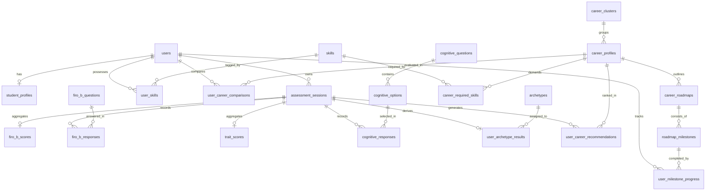

# 🧭 CareerCompass: MySQL 8.0+ Production Database Schema

This document provides the complete, production-grade **MySQL (8.0+) DDL SQL script**, Entity-Relationship Diagram (ERD), and **MySQL-configured Prisma Schema** for **CareerCompass**.

---

## 📑 Table of Contents
1. [Entity Relationship Diagram (ERD)](#1-entity-relationship-diagram-erd)
2. [MySQL 8.0+ Production DDL (SQL Script)](#2-mysql-80-production-ddl-sql-script)
3. [Prisma Schema for MySQL (`schema.prisma`)](#3-prisma-schema-for-mysql-schemaprisma)
4. [Sample Initial Seed Data (MySQL)](#4-sample-initial-seed-data-mysql)

---

## 1. Entity Relationship Diagram (ERD)



---

## 2. MySQL 8.0+ Production DDL (SQL Script)

```sql
-- ==========================================================
-- CAREERCOMPASS PRODUCTION MYSQL SCHEMA (MySQL 8.0+)
-- Engine: InnoDB | Charset: utf8mb4 | Collation: utf8mb4_unicode_ci
-- ==========================================================

CREATE DATABASE IF NOT EXISTS careercompass_db 
CHARACTER SET utf8mb4 
COLLATE utf8mb4_unicode_ci;

USE careercompass_db;

-- ----------------------------------------------------------
-- 1. USERS & ZERO-FRICTION SESSIONS
-- ----------------------------------------------------------
CREATE TABLE IF NOT EXISTS users (
    id VARCHAR(36) PRIMARY KEY,
    email VARCHAR(255) UNIQUE NOT NULL,
    password_hash VARCHAR(255) NULL,
    auth_provider VARCHAR(50) DEFAULT 'local',
    auth_provider_id VARCHAR(255) NULL,
    role ENUM('student', 'professional', 'counselor', 'admin') DEFAULT 'student',
    created_at DATETIME DEFAULT CURRENT_TIMESTAMP,
    updated_at DATETIME DEFAULT CURRENT_TIMESTAMP ON UPDATE CURRENT_TIMESTAMP,
    INDEX idx_users_email (email)
) ENGINE=InnoDB;

CREATE TABLE IF NOT EXISTS assessment_sessions (
    id VARCHAR(36) PRIMARY KEY,
    session_token VARCHAR(128) UNIQUE NOT NULL,
    user_id VARCHAR(36) NULL,
    status ENUM('in_progress', 'completed', 'abandoned') DEFAULT 'in_progress',
    is_firo_b_complete BOOLEAN DEFAULT FALSE,
    is_custom_complete BOOLEAN DEFAULT FALSE,
    started_at DATETIME DEFAULT CURRENT_TIMESTAMP,
    completed_at DATETIME NULL,
    created_at DATETIME DEFAULT CURRENT_TIMESTAMP,
    updated_at DATETIME DEFAULT CURRENT_TIMESTAMP ON UPDATE CURRENT_TIMESTAMP,
    CONSTRAINT fk_sessions_user FOREIGN KEY (user_id) REFERENCES users(id) ON DELETE SET NULL,
    INDEX idx_sessions_token (session_token),
    INDEX idx_sessions_user (user_id)
) ENGINE=InnoDB;

-- ----------------------------------------------------------
-- 2. STUDENT & PROFESSIONAL PROFILES
-- ----------------------------------------------------------
CREATE TABLE IF NOT EXISTS student_profiles (
    id VARCHAR(36) PRIMARY KEY,
    user_id VARCHAR(36) UNIQUE NULL,
    session_id VARCHAR(36) NULL,
    full_name VARCHAR(150) NOT NULL,
    phone VARCHAR(30) NULL,
    age INT NULL,
    gender VARCHAR(30) NULL,
    education_level ENUM(
        'high_school', 
        'undergrad_year_1_2', 
        'undergrad_year_3_4', 
        'postgraduate', 
        'working_professional'
    ) NOT NULL,
    course_stream VARCHAR(200) NOT NULL,
    key_subjects TEXT NULL,
    grade_percentage_or_cgpa VARCHAR(50) NULL,
    created_at DATETIME DEFAULT CURRENT_TIMESTAMP,
    updated_at DATETIME DEFAULT CURRENT_TIMESTAMP ON UPDATE CURRENT_TIMESTAMP,
    CONSTRAINT fk_profiles_user FOREIGN KEY (user_id) REFERENCES users(id) ON DELETE CASCADE,
    CONSTRAINT fk_profiles_session FOREIGN KEY (session_id) REFERENCES assessment_sessions(id) ON DELETE SET NULL
) ENGINE=InnoDB;

CREATE TABLE IF NOT EXISTS skills (
    id VARCHAR(36) PRIMARY KEY,
    name VARCHAR(100) UNIQUE NOT NULL,
    category ENUM('Technical', 'Soft', 'Analytical', 'Domain', 'Tools') DEFAULT 'Technical',
    is_popular BOOLEAN DEFAULT FALSE,
    INDEX idx_skills_name (name)
) ENGINE=InnoDB;

CREATE TABLE IF NOT EXISTS user_skills (
    user_id VARCHAR(36) NOT NULL,
    skill_id VARCHAR(36) NOT NULL,
    proficiency_level VARCHAR(30) DEFAULT 'intermediate',
    created_at DATETIME DEFAULT CURRENT_TIMESTAMP,
    PRIMARY KEY (user_id, skill_id),
    CONSTRAINT fk_userskills_user FOREIGN KEY (user_id) REFERENCES users(id) ON DELETE CASCADE,
    CONSTRAINT fk_userskills_skill FOREIGN KEY (skill_id) REFERENCES skills(id) ON DELETE CASCADE
) ENGINE=InnoDB;

-- ----------------------------------------------------------
-- 3. FIRO-B PSYCHOMETRIC TEST ENGINE (54 Qs)
-- ----------------------------------------------------------
CREATE TABLE IF NOT EXISTS firo_b_questions (
    id INT AUTO_INCREMENT PRIMARY KEY,
    question_text TEXT NOT NULL,
    category ENUM('EI', 'WI', 'EC', 'WC', 'EA', 'WA') NOT NULL,
    category_label VARCHAR(100) NOT NULL,
    order_index INT NOT NULL
) ENGINE=InnoDB;

CREATE TABLE IF NOT EXISTS firo_b_responses (
    id VARCHAR(36) PRIMARY KEY,
    session_id VARCHAR(36) NOT NULL,
    question_id INT NOT NULL,
    score INT NOT NULL,
    created_at DATETIME DEFAULT CURRENT_TIMESTAMP,
    UNIQUE KEY uk_session_firo_question (session_id, question_id),
    CONSTRAINT fk_firoresp_session FOREIGN KEY (session_id) REFERENCES assessment_sessions(id) ON DELETE CASCADE,
    CONSTRAINT fk_firoresp_question FOREIGN KEY (question_id) REFERENCES firo_b_questions(id) ON DELETE CASCADE
) ENGINE=InnoDB;

CREATE TABLE IF NOT EXISTS firo_b_scores (
    id VARCHAR(36) PRIMARY KEY,
    session_id VARCHAR(36) UNIQUE NOT NULL,
    ei_score INT NOT NULL DEFAULT 0, -- Expressed Inclusion (0-54)
    wi_score INT NOT NULL DEFAULT 0, -- Wanted Inclusion
    ec_score INT NOT NULL DEFAULT 0, -- Expressed Control
    wc_score INT NOT NULL DEFAULT 0, -- Wanted Control
    ea_score INT NOT NULL DEFAULT 0, -- Expressed Affection
    wa_score INT NOT NULL DEFAULT 0, -- Wanted Affection
    calculated_at DATETIME DEFAULT CURRENT_TIMESTAMP,
    CONSTRAINT fk_firoscores_session FOREIGN KEY (session_id) REFERENCES assessment_sessions(id) ON DELETE CASCADE
) ENGINE=InnoDB;

-- ----------------------------------------------------------
-- 4. COGNITIVE & SCENARIO TEST ENGINE (30 Qs)
-- ----------------------------------------------------------
CREATE TABLE IF NOT EXISTS cognitive_questions (
    id INT AUTO_INCREMENT PRIMARY KEY,
    question_text TEXT NOT NULL,
    section VARCHAR(100) NOT NULL,
    question_type VARCHAR(50) NOT NULL,
    order_index INT NOT NULL
) ENGINE=InnoDB;

CREATE TABLE IF NOT EXISTS cognitive_options (
    id VARCHAR(50) PRIMARY KEY,
    question_id INT NOT NULL,
    option_text TEXT NOT NULL,
    trait ENUM('Analytical', 'Technical', 'Creative', 'Leadership', 'People') NOT NULL,
    weight INT DEFAULT 1,
    CONSTRAINT fk_cogopt_question FOREIGN KEY (question_id) REFERENCES cognitive_questions(id) ON DELETE CASCADE
) ENGINE=InnoDB;

CREATE TABLE IF NOT EXISTS cognitive_responses (
    id VARCHAR(36) PRIMARY KEY,
    session_id VARCHAR(36) NOT NULL,
    question_id INT NOT NULL,
    selected_option_id VARCHAR(50) NOT NULL,
    created_at DATETIME DEFAULT CURRENT_TIMESTAMP,
    UNIQUE KEY uk_session_cog_question (session_id, question_id),
    CONSTRAINT fk_cogresp_session FOREIGN KEY (session_id) REFERENCES assessment_sessions(id) ON DELETE CASCADE,
    CONSTRAINT fk_cogresp_question FOREIGN KEY (question_id) REFERENCES cognitive_questions(id) ON DELETE CASCADE,
    CONSTRAINT fk_cogresp_option FOREIGN KEY (selected_option_id) REFERENCES cognitive_options(id) ON DELETE CASCADE
) ENGINE=InnoDB;

CREATE TABLE IF NOT EXISTS trait_scores (
    id VARCHAR(36) PRIMARY KEY,
    session_id VARCHAR(36) UNIQUE NOT NULL,
    analytical INT NOT NULL DEFAULT 0,
    technical INT NOT NULL DEFAULT 0,
    creative INT NOT NULL DEFAULT 0,
    leadership INT NOT NULL DEFAULT 0,
    people INT NOT NULL DEFAULT 0,
    calculated_at DATETIME DEFAULT CURRENT_TIMESTAMP,
    CONSTRAINT fk_traitscores_session FOREIGN KEY (session_id) REFERENCES assessment_sessions(id) ON DELETE CASCADE
) ENGINE=InnoDB;

-- ----------------------------------------------------------
-- 5. ARCHETYPES & NEURAL SYNTHESIS
-- ----------------------------------------------------------
CREATE TABLE IF NOT EXISTS archetypes (
    id VARCHAR(80) PRIMARY KEY, -- e.g. 'strategic-architect'
    title VARCHAR(150) NOT NULL,
    badge VARCHAR(100) NOT NULL,
    tagline TEXT NOT NULL,
    description TEXT NOT NULL,
    strengths JSON NOT NULL,
    workplace_vibe TEXT NOT NULL,
    recommended_role_title VARCHAR(150) NOT NULL,
    color_scheme JSON NOT NULL
) ENGINE=InnoDB;

CREATE TABLE IF NOT EXISTS user_archetype_results (
    id VARCHAR(36) PRIMARY KEY,
    session_id VARCHAR(36) UNIQUE NOT NULL,
    archetype_id VARCHAR(80) NOT NULL,
    confidence_score INT DEFAULT 95,
    derived_at DATETIME DEFAULT CURRENT_TIMESTAMP,
    CONSTRAINT fk_userarch_session FOREIGN KEY (session_id) REFERENCES assessment_sessions(id) ON DELETE CASCADE,
    CONSTRAINT fk_userarch_archetype FOREIGN KEY (archetype_id) REFERENCES archetypes(id) ON DELETE RESTRICT
) ENGINE=InnoDB;

-- ----------------------------------------------------------
-- 6. CAREERS, RECOMMENDATIONS & MATCHING
-- ----------------------------------------------------------
CREATE TABLE IF NOT EXISTS career_clusters (
    id VARCHAR(36) PRIMARY KEY,
    name VARCHAR(150) UNIQUE NOT NULL,
    slug VARCHAR(150) UNIQUE NOT NULL,
    icon_name VARCHAR(50) NOT NULL,
    description TEXT NOT NULL
) ENGINE=InnoDB;

CREATE TABLE IF NOT EXISTS career_profiles (
    id VARCHAR(80) PRIMARY KEY, -- e.g. 'data-analyst'
    cluster_id VARCHAR(36) NOT NULL,
    title VARCHAR(200) NOT NULL,
    summary TEXT NOT NULL,
    description TEXT NOT NULL,
    salary_entry VARCHAR(80) NOT NULL,
    salary_mid VARCHAR(80) NOT NULL,
    salary_senior VARCHAR(80) NOT NULL,
    work_environment TEXT NOT NULL,
    growth_rate VARCHAR(50) DEFAULT '+22% (High Demand)',
    CONSTRAINT fk_careers_cluster FOREIGN KEY (cluster_id) REFERENCES career_clusters(id) ON DELETE RESTRICT
) ENGINE=InnoDB;

CREATE TABLE IF NOT EXISTS career_required_skills (
    career_id VARCHAR(80) NOT NULL,
    skill_id VARCHAR(36) NOT NULL,
    is_mandatory BOOLEAN DEFAULT TRUE,
    PRIMARY KEY (career_id, skill_id),
    CONSTRAINT fk_reqskills_career FOREIGN KEY (career_id) REFERENCES career_profiles(id) ON DELETE CASCADE,
    CONSTRAINT fk_reqskills_skill FOREIGN KEY (skill_id) REFERENCES skills(id) ON DELETE CASCADE
) ENGINE=InnoDB;

CREATE TABLE IF NOT EXISTS user_career_recommendations (
    id VARCHAR(36) PRIMARY KEY,
    session_id VARCHAR(36) NOT NULL,
    career_id VARCHAR(80) NOT NULL,
    rank_order INT NOT NULL,
    match_score INT NOT NULL,
    why_match_reasons JSON NOT NULL,
    generated_at DATETIME DEFAULT CURRENT_TIMESTAMP,
    UNIQUE KEY uk_session_career_rec (session_id, career_id),
    INDEX idx_user_recs_score (session_id, match_score DESC),
    CONSTRAINT fk_userrec_session FOREIGN KEY (session_id) REFERENCES assessment_sessions(id) ON DELETE CASCADE,
    CONSTRAINT fk_userrec_career FOREIGN KEY (career_id) REFERENCES career_profiles(id) ON DELETE CASCADE
) ENGINE=InnoDB;

-- ----------------------------------------------------------
-- 7. COMPARISONS & 5-YEAR LEARNING ROADMAPS
-- ----------------------------------------------------------
CREATE TABLE IF NOT EXISTS user_career_comparisons (
    id VARCHAR(36) PRIMARY KEY,
    session_id VARCHAR(36) NOT NULL,
    career_id VARCHAR(80) NOT NULL,
    created_at DATETIME DEFAULT CURRENT_TIMESTAMP,
    UNIQUE KEY uk_session_career_comp (session_id, career_id),
    CONSTRAINT fk_usercomp_session FOREIGN KEY (session_id) REFERENCES assessment_sessions(id) ON DELETE CASCADE,
    CONSTRAINT fk_usercomp_career FOREIGN KEY (career_id) REFERENCES career_profiles(id) ON DELETE CASCADE
) ENGINE=InnoDB;

CREATE TABLE IF NOT EXISTS career_roadmaps (
    id VARCHAR(36) PRIMARY KEY,
    career_id VARCHAR(80) NOT NULL,
    phase_number INT NOT NULL,
    phase_title VARCHAR(150) NOT NULL,
    duration_months VARCHAR(50) NOT NULL,
    phase_focus TEXT NOT NULL,
    CONSTRAINT fk_roadmaps_career FOREIGN KEY (career_id) REFERENCES career_profiles(id) ON DELETE CASCADE
) ENGINE=InnoDB;

CREATE TABLE IF NOT EXISTS roadmap_milestones (
    id VARCHAR(36) PRIMARY KEY,
    roadmap_id VARCHAR(36) NOT NULL,
    milestone_title VARCHAR(255) NOT NULL,
    resource_recommendation TEXT NULL,
    order_index INT NOT NULL,
    CONSTRAINT fk_milestones_roadmap FOREIGN KEY (roadmap_id) REFERENCES career_roadmaps(id) ON DELETE CASCADE
) ENGINE=InnoDB;

CREATE TABLE IF NOT EXISTS user_milestone_progress (
    id VARCHAR(36) PRIMARY KEY,
    user_id VARCHAR(36) NOT NULL,
    milestone_id VARCHAR(36) NOT NULL,
    is_completed BOOLEAN DEFAULT TRUE,
    completed_at DATETIME DEFAULT CURRENT_TIMESTAMP,
    UNIQUE KEY uk_user_milestone (user_id, milestone_id),
    CONSTRAINT fk_milestoneprog_user FOREIGN KEY (user_id) REFERENCES users(id) ON DELETE CASCADE,
    CONSTRAINT fk_milestoneprog_milestone FOREIGN KEY (milestone_id) REFERENCES roadmap_milestones(id) ON DELETE CASCADE
) ENGINE=InnoDB;
```

---

## 3. Prisma Schema for MySQL (`schema.prisma`)

```prisma
datasource db {
  provider = "mysql"
  url      = env("DATABASE_URL")
}

generator client {
  provider = "prisma-client-js"
}

enum UserRole {
  student
  professional
  counselor
  admin
}

enum SessionStatus {
  in_progress
  completed
  abandoned
}

enum EducationLevel {
  high_school
  undergrad_year_1_2
  undergrad_year_3_4
  postgraduate
  working_professional
}

enum FiroBDimension {
  EI
  WI
  EC
  WC
  EA
  WA
}

enum TraitCategory {
  Analytical
  Technical
  Creative
  Leadership
  People
}

enum SkillCategory {
  Technical
  Soft
  Analytical
  Domain
  Tools
}

model User {
  id               String                   @id @default(uuid()) @db.VarChar(36)
  email            String                   @unique @db.VarChar(255)
  passwordHash     String?                  @map("password_hash") @db.VarChar(255)
  authProvider     String                   @default("local") @map("auth_provider") @db.VarChar(50)
  authProviderId   String?                  @map("auth_provider_id") @db.VarChar(255)
  role             UserRole                 @default(student)
  createdAt        DateTime                 @default(now()) @map("created_at")
  updatedAt        DateTime                 @default(now()) @updatedAt @map("updated_at")

  profile          StudentProfile?
  sessions         AssessmentSession[]
  skills           UserSkill[]
  milestoneProgress UserMilestoneProgress[]

  @@map("users")
}

model AssessmentSession {
  id               String                   @id @default(uuid()) @db.VarChar(36)
  sessionToken     String                   @unique @map("session_token") @db.VarChar(128)
  userId           String?                  @map("user_id") @db.VarChar(36)
  user             User?                    @relation(fields: [userId], references: [id], onDelete: SetNull)
  status           SessionStatus            @default(in_progress)
  isFiroBComplete  Boolean                  @default(false) @map("is_firo_b_complete")
  isCustomComplete Boolean                  @default(false) @map("is_custom_complete")
  startedAt        DateTime                 @default(now()) @map("started_at")
  completedAt      DateTime?                @map("completed_at")
  createdAt        DateTime                 @default(now()) @map("created_at")
  updatedAt        DateTime                 @default(now()) @updatedAt @map("updated_at")

  profiles         StudentProfile[]
  firoBResponses   FiroBResponse[]
  firoBScores      FiroBScore?
  cognitiveResponses CognitiveResponse[]
  traitScores      TraitScore?
  archetypeResult  UserArchetypeResult?
  recommendations  UserCareerRecommendation[]
  comparisons      UserCareerComparison[]

  @@index([sessionToken], name: "idx_sessions_token")
  @@index([userId], name: "idx_sessions_user")
  @@map("assessment_sessions")
}

model StudentProfile {
  id                     String             @id @default(uuid()) @db.VarChar(36)
  userId                 String?            @unique @map("user_id") @db.VarChar(36)
  user                   User?              @relation(fields: [userId], references: [id], onDelete: Cascade)
  sessionId              String?            @map("session_id") @db.VarChar(36)
  session                AssessmentSession? @relation(fields: [sessionId], references: [id], onDelete: SetNull)
  fullName               String             @map("full_name") @db.VarChar(150)
  phone                  String?            @db.VarChar(30)
  age                    Int?
  gender                 String?            @db.VarChar(30)
  educationLevel         EducationLevel     @map("education_level")
  courseStream           String             @map("course_stream") @db.VarChar(200)
  keySubjects            String?            @map("key_subjects") @db.Text
  gradePercentageOrCgpa  String?            @map("grade_percentage_or_cgpa") @db.VarChar(50)
  createdAt              DateTime           @default(now()) @map("created_at")
  updatedAt              DateTime           @default(now()) @updatedAt @map("updated_at")

  @@map("student_profiles")
}

model Skill {
  id           String                @id @default(uuid()) @db.VarChar(36)
  name         String                @unique @db.VarChar(100)
  category     SkillCategory         @default(Technical)
  isPopular    Boolean               @default(false) @map("is_popular")
  userSkills   UserSkill[]
  careerSkills CareerRequiredSkill[]

  @@map("skills")
}

model UserSkill {
  userId           String   @map("user_id") @db.VarChar(36)
  skillId          String   @map("skill_id") @db.VarChar(36)
  proficiencyLevel String   @default("intermediate") @map("proficiency_level") @db.VarChar(30)
  createdAt        DateTime @default(now()) @map("created_at")
  user             User     @relation(fields: [userId], references: [id], onDelete: Cascade)
  skill            Skill    @relation(fields: [skillId], references: [id], onDelete: Cascade)

  @@id([userId, skillId])
  @@map("user_skills")
}

model FiroBQuestion {
  id            Int             @id @default(autoincrement())
  questionText  String          @map("question_text") @db.Text
  category      FiroBDimension
  categoryLabel String          @map("category_label") @db.VarChar(100)
  orderIndex    Int             @map("order_index")
  responses     FiroBResponse[]

  @@map("firo_b_questions")
}

model FiroBResponse {
  id         String            @id @default(uuid()) @db.VarChar(36)
  sessionId  String            @map("session_id") @db.VarChar(36)
  questionId Int               @map("question_id")
  score      Int
  createdAt  DateTime          @default(now()) @map("created_at")
  session    AssessmentSession @relation(fields: [sessionId], references: [id], onDelete: Cascade)
  question   FiroBQuestion     @relation(fields: [questionId], references: [id], onDelete: Cascade)

  @@unique([sessionId, questionId], name: "uk_session_firo_question")
  @@map("firo_b_responses")
}

model FiroBScore {
  id           String            @id @default(uuid()) @db.VarChar(36)
  sessionId    String            @unique @map("session_id") @db.VarChar(36)
  session      AssessmentSession @relation(fields: [sessionId], references: [id], onDelete: Cascade)
  eiScore      Int               @default(0) @map("ei_score")
  wiScore      Int               @default(0) @map("wi_score")
  ecScore      Int               @default(0) @map("ec_score")
  wcScore      Int               @default(0) @map("wc_score")
  eaScore      Int               @default(0) @map("ea_score")
  waScore      Int               @default(0) @map("wa_score")
  calculatedAt DateTime          @default(now()) @map("calculated_at")

  @@map("firo_b_scores")
}

model CognitiveQuestion {
  id           Int               @id @default(autoincrement())
  questionText String            @map("question_text") @db.Text
  section      String            @db.VarChar(100)
  questionType String            @map("question_type") @db.VarChar(50)
  orderIndex   Int               @map("order_index")
  options      CognitiveOption[]
  responses    CognitiveResponse[]

  @@map("cognitive_questions")
}

model CognitiveOption {
  id          String            @id @db.VarChar(50)
  questionId  Int               @map("question_id")
  optionText  String            @map("option_text") @db.Text
  trait       TraitCategory
  weight      Int               @default(1)
  question    CognitiveQuestion @relation(fields: [questionId], references: [id], onDelete: Cascade)
  responses   CognitiveResponse[]

  @@map("cognitive_options")
}

model CognitiveResponse {
  id               String            @id @default(uuid()) @db.VarChar(36)
  sessionId        String            @map("session_id") @db.VarChar(36)
  questionId       Int               @map("question_id")
  selectedOptionId String            @map("selected_option_id") @db.VarChar(50)
  createdAt        DateTime          @default(now()) @map("created_at")
  session          AssessmentSession @relation(fields: [sessionId], references: [id], onDelete: Cascade)
  question         CognitiveQuestion @relation(fields: [questionId], references: [id], onDelete: Cascade)
  selectedOption   CognitiveOption   @relation(fields: [selectedOptionId], references: [id], onDelete: Cascade)

  @@unique([sessionId, questionId], name: "uk_session_cog_question")
  @@map("cognitive_responses")
}

model TraitScore {
  id           String            @id @default(uuid()) @db.VarChar(36)
  sessionId    String            @unique @map("session_id") @db.VarChar(36)
  session      AssessmentSession @relation(fields: [sessionId], references: [id], onDelete: Cascade)
  analytical   Int               @default(0)
  technical    Int               @default(0)
  creative     Int               @default(0)
  leadership   Int               @default(0)
  people       Int               @default(0)
  calculatedAt DateTime          @default(now()) @map("calculated_at")

  @@map("trait_scores")
}

model Archetype {
  id                  String                @id @db.VarChar(80)
  title               String                @db.VarChar(150)
  badge               String                @db.VarChar(100)
  tagline             String                @db.Text
  description         String                @db.Text
  strengths           Json
  workplaceVibe       String                @map("workplace_vibe") @db.Text
  recommendedRoleTitle String               @map("recommended_role_title") @db.VarChar(150)
  colorScheme         Json                  @map("color_scheme")
  userResults         UserArchetypeResult[]

  @@map("archetypes")
}

model UserArchetypeResult {
  id              String            @id @default(uuid()) @db.VarChar(36)
  sessionId       String            @unique @map("session_id") @db.VarChar(36)
  archetypeId     String            @map("archetype_id") @db.VarChar(80)
  confidenceScore Int               @default(95) @map("confidence_score")
  derivedAt       DateTime          @default(now()) @map("derived_at")
  session         AssessmentSession @relation(fields: [sessionId], references: [id], onDelete: Cascade)
  archetype       Archetype         @relation(fields: [archetypeId], references: [id])

  @@map("user_archetype_results")
}

model CareerCluster {
  id          String          @id @default(uuid()) @db.VarChar(36)
  name        String          @unique @db.VarChar(150)
  slug        String          @unique @db.VarChar(150)
  iconName    String          @map("icon_name") @db.VarChar(50)
  description String          @db.Text
  careers     CareerProfile[]

  @@map("career_clusters")
}

model CareerProfile {
  id              String                     @id @db.VarChar(80)
  clusterId       String                     @map("cluster_id") @db.VarChar(36)
  cluster         CareerCluster              @relation(fields: [clusterId], references: [id])
  title           String                     @db.VarChar(200)
  summary         String                     @db.Text
  description     String                     @db.Text
  salaryEntry     String                     @map("salary_entry") @db.VarChar(80)
  salaryMid       String                     @map("salary_mid") @db.VarChar(80)
  salarySenior    String                     @map("salary_senior") @db.VarChar(80)
  workEnvironment String                     @map("work_environment") @db.Text
  growthRate      String                     @default("+22% (High Demand)") @map("growth_rate") @db.VarChar(50)
  
  requiredSkills  CareerRequiredSkill[]
  recommendations UserCareerRecommendation[]
  comparisons     UserCareerComparison[]
  roadmaps        CareerRoadmap[]

  @@map("career_profiles")
}

model CareerRequiredSkill {
  careerId    String        @map("career_id") @db.VarChar(80)
  skillId     String        @map("skill_id") @db.VarChar(36)
  isMandatory Boolean       @default(true) @map("is_mandatory")
  career      CareerProfile @relation(fields: [careerId], references: [id], onDelete: Cascade)
  skill       Skill         @relation(fields: [skillId], references: [id], onDelete: Cascade)

  @@id([careerId, skillId])
  @@map("career_required_skills")
}

model UserCareerRecommendation {
  id                    String            @id @default(uuid()) @db.VarChar(36)
  sessionId             String            @map("session_id") @db.VarChar(36)
  careerId              String            @map("career_id") @db.VarChar(80)
  rankOrder             Int               @map("rank_order")
  matchScore            Int               @map("match_score")
  whyMatchReasons       Json              @map("why_match_reasons")
  generatedAt           DateTime          @default(now()) @map("generated_at")
  session               AssessmentSession @relation(fields: [sessionId], references: [id], onDelete: Cascade)
  career                CareerProfile     @relation(fields: [careerId], references: [id], onDelete: Cascade)

  @@unique([sessionId, careerId], name: "uk_session_career_rec")
  @@index([sessionId, matchScore(sort: Desc)], name: "idx_user_recs_score")
  @@map("user_career_recommendations")
}

model UserCareerComparison {
  id        String            @id @default(uuid()) @db.VarChar(36)
  sessionId String            @map("session_id") @db.VarChar(36)
  careerId  String            @map("career_id") @db.VarChar(80)
  createdAt DateTime          @default(now()) @map("created_at")
  session   AssessmentSession @relation(fields: [sessionId], references: [id], onDelete: Cascade)
  career    CareerProfile     @relation(fields: [careerId], references: [id], onDelete: Cascade)

  @@unique([sessionId, careerId], name: "uk_session_career_comp")
  @@map("user_career_comparisons")
}

model CareerRoadmap {
  id             String             @id @default(uuid()) @db.VarChar(36)
  careerId       String             @map("career_id") @db.VarChar(80)
  career         CareerProfile      @relation(fields: [careerId], references: [id], onDelete: Cascade)
  phaseNumber    Int                @map("phase_number")
  phaseTitle     String             @map("phase_title") @db.VarChar(150)
  durationMonths String             @map("duration_months") @db.VarChar(50)
  phaseFocus     String             @map("phase_focus") @db.Text
  milestones     RoadmapMilestone[]

  @@map("career_roadmaps")
}

model RoadmapMilestone {
  id                     String                  @id @default(uuid()) @db.VarChar(36)
  roadmapId              String                  @map("roadmap_id") @db.VarChar(36)
  roadmap                CareerRoadmap           @relation(fields: [roadmapId], references: [id], onDelete: Cascade)
  milestoneTitle         String                  @map("milestone_title") @db.VarChar(255)
  resourceRecommendation String?                 @map("resource_recommendation") @db.Text
  orderIndex             Int                     @map("order_index")
  userProgress           UserMilestoneProgress[]

  @@map("roadmap_milestones")
}

model UserMilestoneProgress {
  id          String           @id @default(uuid()) @db.VarChar(36)
  userId      String           @map("user_id") @db.VarChar(36)
  milestoneId String           @map("milestone_id") @db.VarChar(36)
  isCompleted Boolean          @default(true) @map("is_completed")
  completedAt DateTime         @default(now()) @map("completed_at")
  user        User             @relation(fields: [userId], references: [id], onDelete: Cascade)
  milestone   RoadmapMilestone @relation(fields: [milestoneId], references: [id], onDelete: Cascade)

  @@unique([userId, milestoneId], name: "uk_user_milestone")
  @@map("user_milestone_progress")
}
```

---

## 4. Sample Initial Seed Data (MySQL)

```sql
-- Insert Core Archetypes
INSERT INTO archetypes (id, title, badge, tagline, description, strengths, workplace_vibe, recommended_role_title, color_scheme) 
VALUES 
('strategic-architect', 'The Strategic Systems Architect', 'Analytical • High Autonomy', 
 'You naturally decompose complex multi-layered problems into elegant, scalable systems.', 
 'You thrive when given high autonomy to design solutions from first principles.', 
 '["Systems Thinking", "Abstract Problem Solving", "High Autonomy Execution", "Architectural Modeling"]', 
 'Deep-work research labs, technical architecture squads, high-ownership engineering pods.', 
 'AI/ML Solutions Architect', 
 '{"primary": "#1E3A34", "secondary": "#C86D51", "bgAccent": "#F3F1E7"}'),

('collaborative-catalyst', 'The Collaborative Innovation Catalyst', 'High Affection • Agile Leadership', 
 'You bridge the gap between human empathy, team velocity, and ambitious product vision.', 
 'You possess high Wanted & Expressed Affection, making you an empathetic force multiplier.', 
 '["Cross-Functional Alignment", "Product Sense", "Empathetic Leadership", "Agile Facilitation"]', 
 'High-growth product squads, user research labs, customer-centric innovation hubs.', 
 'Technical Product Lead', 
 '{"primary": "#1E3A34", "secondary": "#E07A5F", "bgAccent": "#FBF9F5"}');

-- Insert Sample Popular Skills
INSERT INTO skills (id, name, category, is_popular) VALUES 
(UUID(), 'Python', 'Technical', TRUE),
(UUID(), 'SQL', 'Technical', TRUE),
(UUID(), 'Data Analysis', 'Analytical', TRUE),
(UUID(), 'React', 'Technical', TRUE),
(UUID(), 'Machine Learning', 'Technical', TRUE),
(UUID(), 'UI/UX Design', 'Creative', TRUE),
(UUID(), 'Strategic Planning', 'Leadership', TRUE),
(UUID(), 'Public Speaking', 'Soft', TRUE);
```
