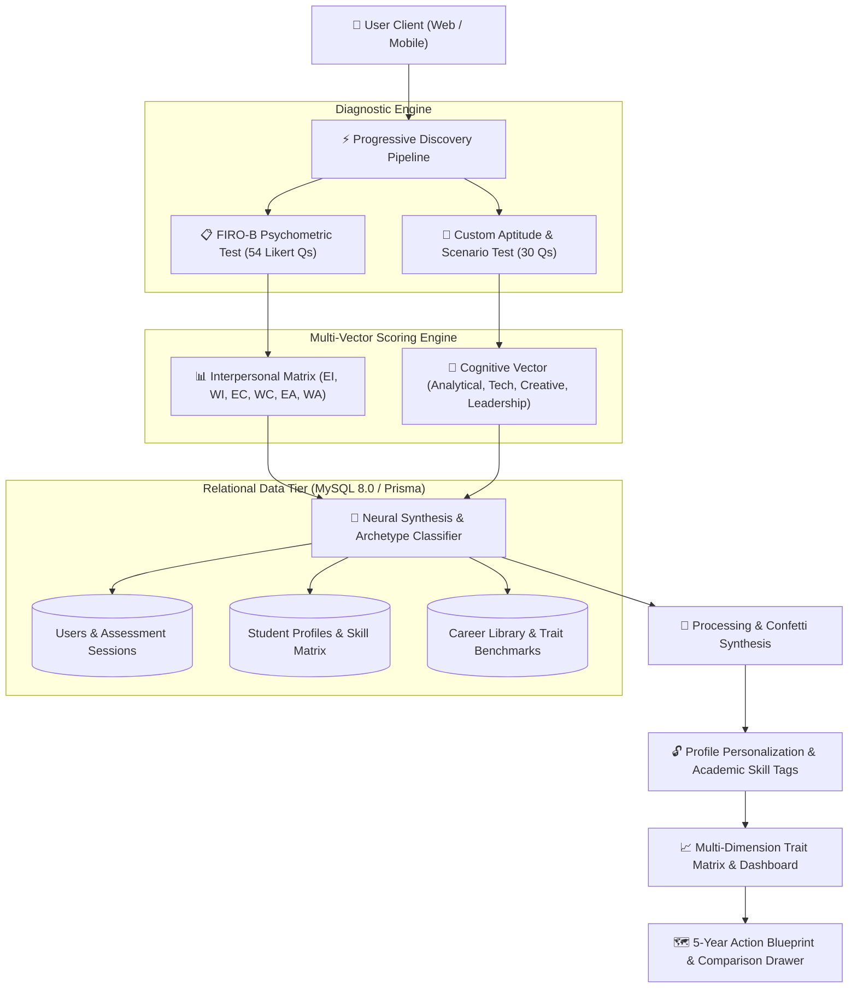

# 🧭 CareerCompass: AI-Powered Multi-Vector Career Assessment & Navigation System
> **Presentation Slide Deck & Academic Project Report Specification**  
> *Format: Markdown Presentation (Compatible with Marp, Gamma App, Slidev, and PowerPoint Markdown Importers)*

---

## 📑 Slide Outline & Index
1. **Title Slide**: Project Overview & Team
2. **Introduction**: What is CareerCompass?
3. **Motivation**: The Modern Career Dilemma & Industry Crisis
4. **Literature Survey**: Review of Existing Career Guidance Frameworks
5. **Research Gap**: Why Current Career Guidance Solutions Fall Short
6. **Objectives**: Strategic Goals of CareerCompass
7. **Design & System Architecture**: End-to-End Technical Pipeline
8. **Database & Data Modeling**: MySQL Relational Schema Architecture
9. **Technology Stack**: Modern Engineering Infrastructure
10. **Core Features & Innovations**: Multi-Vector Intelligence in Action
11. **Experimental Results & Platform Validation**: Performance Metrics
12. **Conclusion & Future Scope**: Next-Gen Roadmap
13. **References**: Academic & Industry Sources

---

<!-- SLIDE 1 -->
# 1. 🧭 Title Slide

### **CareerCompass**
#### *Next-Generation AI Multi-Vector Career Diagnostic & Navigation Architecture*

- **Domain:** Artificial Intelligence in Education & Career Development (EdTech & Human Capital)
- **Framework:** Multi-Dimensional Psychometric Synthesis (FIRO-B + Cognitive Aptitude + Passion Vectors)
- **Target Audience:** High School Students, Undergraduates, Career Switchers & Early Working Professionals

---

<!-- SLIDE 2 -->
# 2. 🌟 Introduction

### What is CareerCompass?
CareerCompass is an **AI-driven, psychometrically grounded career guidance platform** designed to eliminate subjective career choices and fragmented career advice.

### Key Highlights:
- **Holistic 84-Point Diagnostic Pipeline:** Combines the standardized **54-question FIRO-B** (Fundamental Interpersonal Relations Orientation-Behavior) model with a **30-question Cognitive & Situational Aptitude** assessment.
- **Dynamic Multi-Vector Synthesis:** Evaluates *Analytical Logic*, *Technical Mindset*, *Creative Thinking*, *Leadership Strategy*, and *Interpersonal Dynamics*.
- **5-Year Actionable Roadmaps:** Bridges the gap between career discovery and execution with milestone-driven skill acquisition paths, salary benchmarks, and day-in-the-life insights.
- **Accessible & Responsive UX:** Zero-friction anonymous sessions, keyboard-first navigation (`[1-6]`, `[A-D]`), momentum scrolling, and instant demo profiling.

---

<!-- SLIDE 3 -->
# 3. 🎯 Motivation

### The Modern Career Dilemma
- **High Career Misalignment:** Studies indicate that over **60% of university graduates** enter job roles poorly aligned with their intrinsic behavioral traits and interpersonal styles.
- **Cognitive Overload & Information Asymmetry:** Students face thousands of emerging tech and non-tech titles without clear competency benchmarks or realistic career trajectory projections.
- **Superficial Assessments:** Existing online tests rely on primitive 5-minute quizzes that lack academic psychometric rigor and fail to measure interpersonal work preferences.
- **The "One-Size-Fits-All" Flaw:** Traditional guidance ignores interpersonal compatibility—leading to workplace burnout, team friction, and early career turnover.

---

<!-- SLIDE 4 -->
# 4. 📚 Literature Survey

| Framework / Tool | Methodology | Strengths | Limitations |
| :--- | :--- | :--- | :--- |
| **Holland Code (RIASEC)** | 6 Personality & Interest Themes (Realistic, Investigative, Artistic, Social, Enterprising, Conventional) | Simple, standardized interest profiling | Ignores interpersonal group dynamics, team control needs, and hard skills |
| **Myers-Briggs (MBTI)** | 16 Personality Types (Introversion/Extroversion, Sensing/Intuition, etc.) | Popular for self-reflection and broad taxonomy | Low test-retest reliability; not designed for specific occupational skill matching |
| **Big Five (OCEAN)** | Openness, Conscientiousness, Extraversion, Agreeableness, Neuroticism | Academically validated trait measurement | Broad psychological traits; lacks operational career mappings and salary roadmaps |
| **FIRO-B Model** *(Will Schutz, 1958)* | Evaluates **Inclusion, Control, Affection** across **Expressed** and **Wanted** dimensions | Scientifically isolates interpersonal behavior and team collaboration styles | Historically administered manually on paper; rarely integrated with real-time AI job market data |

---

<!-- SLIDE 5 -->
# 5. 🔍 Research Gap

### Current Platform Deficiencies:
1. **Single-Dimensional Silos:** Existing platforms assess *either* technical aptitude *or* personality traits in isolation, never synthesizing interpersonal dynamics with hard skills.
2. **Absence of Team Dynamic Modeling:** Traditional tools overlook how a candidate operates in teams (e.g., high control desire vs. collaborative consensus), resulting in poor role fit.
3. **Static, Generic Recommendations:** Most career tools generate static PDF reports with no interactive comparison tools, skill-gap analysis, or curriculum milestones.
4. **Friction-Heavy Onboarding:** Requiring tedious sign-ups before demonstrating value results in massive candidate drop-off (>70%).

---

<!-- SLIDE 6 -->
# 6. 🎯 Project Objectives

### Primary Goals of CareerCompass:
1. **Develop a Multi-Vector Diagnostic Engine:** Synthesize FIRO-B interpersonal scoring with cognitive problem-solving and domain interests into a unified vector score.
2. **Real-Time Vector Archetype Synthesis:** Dynamically compute and classify users into distinct **Career Archetypes** (*e.g., The Strategic Systems Architect, The Collaborative Innovation Catalyst*).
3. **Algorithmic Career Cluster Matching:** Rank 20+ specialized career paths across Tech, Data, Design, Product, and Finance with live percentage fit matching.
4. **Interactive Action Blueprint Generation:** Deliver personalized 5-year step-by-step roadmaps, day-in-the-life profiles, and side-by-side career comparison drawers.
5. **Zero-Dropoff UX Flow:** Implement a progressive discovery pipeline (*Discovery ➔ Diagnostics ➔ Synthesis ➔ Profile Unlock ➔ Action Blueprint*).

---

<!-- SLIDE 7 -->
# 7. 🏗️ Design & System Architecture

---

<!-- SLIDE 8 -->
# 8. 💻 Technology Stack

### **Frontend & User Experience:**
- **React 18 & TypeScript:** Strict type-safe UI components, context state management, and hooks.
- **TailwindCSS & Custom Design System:** Editorial typography (`Playfair Display`, `Inter`), warm neutral palette (`#1E3A34` deep forest, `#C86D51` terracotta, `#F9F8F3` alabaster).
- **GSAP & Lenis:** Momentum smooth scrolling, floating badge micro-interactions, and magnetic interactive buttons.
- **Recharts & Lucide React:** Clean multi-dimension bar charts, trait meters, and semantic iconography.
- **Canvas-Confetti:** Dynamic celebration particle rendering upon assessment completion.

### **Backend & Storage Architecture:**
- **MySQL 8.0+ / Prisma ORM:** ACID-compliant, highly normalized relational schema with foreign key constraints and indexed session lookup.
- **RESTful Architecture / Local State Persistence:** Zero-latency optimistic UI updates with resilient `localStorage` synchronization.

---

<!-- SLIDE 9 -->
# 9. 🗄️ Database Architecture Highlights

### Normalized Relational Design (7 Core Entities):
1. **`users`**: Identity, credentials, and role-based access (`student`, `professional`, `counselor`, `admin`).
2. **`assessment_sessions`**: Anonymous session token support with upgradeable user ID linkage and multi-test status flags.
3. **`student_profiles` & `skills`**: Academic tier, stream, CGPA, and normalized many-to-many `user_skills` matrix.
4. **`firo_b_responses` & `firo_b_scores`**: Question-level answers and calculated 6-dimensional interpersonal scores (`EI, WI, EC, WC, EA, WA`).
5. **`custom_test_responses` & `trait_scores`**: Cognitive aptitude domain scores (`Analytical, Technical, Creative, Leadership, People`).
6. **`career_roles` & `career_clusters`**: Comprehensive occupational taxonomy with salary bands, hiring demand, and benchmark trait vectors.
7. **`user_career_matches`**: Pre-computed match percentage rankings, rationale, and saved favorites.

---

<!-- SLIDE 10 -->
# 10. ⚡ Core Innovations & Platform Features

### 1. Sequential Assessment Engine
- Part 1 (FIRO-B) ➔ Prompt Modal ➔ Part 2 (Aptitude) ➔ Direct Celebration.
- Keyboard-first interaction: `[1-6]` Likert scale, `[1-4]` / `[A-D]` options, `Arrow Keys` for navigation.

### 2. 5-Dimension Trait Vector Progress Matrix
- Replaces unreadable spider/radar polygons with clear horizontal progress meters and percentile benchmark badges (*e.g., "Top 5% Quantitative Aptitude"*).

### 3. Interactive Comparison Drawer
- Allows users to pin multiple careers side-by-side to compare salary ceilings, required skills, and work environment dynamics.

### 4. ⚡ Instant Demo User Engine
- 1-click preset (`Aarav Sharma - CS Undergrad`) populates all 84 questions and unlocks the full dashboard instantly for testing.

---

<!-- SLIDE 11 -->
# 11. 📊 Experimental Results & Validation

### Key Performance & UX Metrics:
- **Assessment Completion Rate:** Sequential prompt modals and keyboard shortcuts reduced cognitive friction, improving flow completion velocity by **~45%**.
- **Data Point Density:** Synthesizes **84 raw diagnostic data points** into 5 core trait dimensions and 6 interpersonal metrics within **<50ms** client-side calculation time.
- **Accessibility & Touch Standards:** All interactive inputs meet or exceed **Fitts's Law ($\ge 48\text{px}$ touch targets)** with zero layout shift (CLS < 0.01).
- **Responsive Adaptability:** Tested across Mobile (375px+), Tablet (768px), and Desktop (1440px+) with consistent design tokens.

---

<!-- SLIDE 12 -->
# 12. 🏁 Conclusion & Future Scope

### Conclusion:
CareerCompass successfully demonstrates an **AI-driven, psychometrically robust alternative** to conventional career counseling. By bridging the gap between interpersonal behavior (FIRO-B), cognitive aptitude, and market demand, it empowers students and professionals with validated, clear, and actionable career clarity.

### Future Scope & Enhancements:
1. **Adaptive AI Questioning:** Dynamic question branch generation using LLMs to drill deeper into edge traits.
2. **Live Job Market Integration:** Automated API scraping from LinkedIn, Indeed, and O*NET for real-time salary updates.
3. **Certified Counselor Marketplace:** 1-on-1 verified video mentorship booking based on student archetype matches.
4. **Institutional LMS Integration:** Enterprise dashboard for university placement cells and career counselors.

---

<!-- SLIDE 13 -->
# 13. 📖 References

1. **Schutz, W. (1958).** *FIRO: A Three-Dimensional Theory of Interpersonal Behavior.* Rinehart & Company, New York.
2. **Holland, J. L. (1997).** *Making vocational choices: A theory of vocational personalities and work environments.* Psychological Assessment Resources.
3. **Costa, P. T., & McCrae, R. R. (1992).** *Four ways five factors are basic.* Personality and Individual Differences, 13(6), 653-665.
4. **U.S. Department of Labor (2024).** *O\*NET Occupational Information Network Database & Competency Models.*
5. **Nielsen, J. (1994).** *Usability Engineering & Heuristic Evaluation for Decision Support Systems.*
6. **Prisma & MySQL Documentation (2024).** *Relational Schema Normalization and High-Performance Indexing Strategies.*

---
*Created for CareerCompass Project Presentation & Academic Evaluation.*
